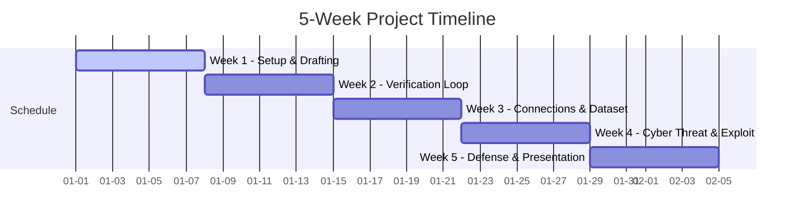

# **NSF RET Summer Camp: 5-Week Project Weekly Schedule**

This document outlines the weekly milestones and core concepts for the K14 teachers completing the **Trustless Edge-Cloud Speculative Decoding** project.

---

## **Weekly Overview**

---

## **Week 1 — Environment Setup & Local Drafting**

* **Build Steps Covered:** Step 0 (Prepare Virtual Environment) & Step 1 (Local Speculative Drafting)
* **Goal:** Set up local Python environments on laptops, download the ultra-lightweight Small Language Model (SLM), and inspect text prompts converted into token IDs.
* **Core Concepts:**
  * Auto-regressive decoding bottlenecks on edge devices.
  * Tokenization (how models convert text into integer Token IDs).
  * Virtual environments (`venv`) and dependency installation.
* **Deliverable / Checkpoint:** Running `python edge_draft.py` on your laptop CPU successfully downloads and loads the 0.5B model, generating 5 draft token IDs.

---

## **Week 2 — Verification Logic & Remote Server Boot**

* **Build Steps Covered:** Step 2 (Simulating Verification) & Step 3 (Turning Server into a Service)
* **Goal:** Write a mock validation loop locally, connect to the GPU server using SSH/JupyterLab, copy your files, and start the remote API server.
* **Core Concepts:**
  * Autoregressive check rules (rejecting all tokens following the first mismatch).
  * Client-server models and web services (REST API endpoints).
  * Loading large models (7-Billion parameters) on remote GPU servers.
* **Deliverable / Checkpoint:** 
  * running `python simulate_verify.py` locally outputs `Final Generated Acceptance Bitmap: [1, 1, 0]`.
  * running `python server.py` on the GPU server starts the FastAPI web service on port `8000`.

---

## **Week 3 — Network Connections & Benchmark Datasets**

* **Build Steps Covered:** Step 4 (Connect Laptop to Server) & Step 5 (Measure System Performance)
* **Goal:** Route client requests from your laptop to the remote GPU server IP, load the `sharegpt_subset.json` dataset, and write a script to automatically test and measure performance.
* **Core Concepts:**
  * HTTP POST request payloads and network latency.
  * Benchmark datasets in AI research (understanding ShareGPT formatting).
  * Performance metrics: Network Latency (s) vs. Token Acceptance Rate (%).
* **Deliverable / Checkpoint:** Running `python benchmark.py` queries the server for all 15 prompts in the dataset and writes the averages to `benchmark_results.txt`.

---

## **Week 4 — Cyber Exploits & Threat Modeling**

* **Build Steps Covered:** Step 6 (Implement the Man-in-the-Middle Attack)
* **Goal:** Launch the attacker proxy server on port 8001, route client requests through it, and observe how altering token IDs in transit corrupts AI generations.
* **Core Concepts:**
  * Man-in-the-Middle (MitM) routing hijack attacks.
  * Data payload tampering in distributed inference environments.
  * Security risks of untrusted network channels in Edge AI.
* **Deliverable / Checkpoint:** Pointing your client script to the attacker (port `8001`) redirects traffic, causing token corruption and a zero acceptance rate at the server.

---

## **Week 5 — Cryptographic Attestation & Final Showcase**

* **Build Steps Covered:** Step 7 (Deploy Cryptographic Defense) & Final Presentation
* **Goal:** Implement SHA-256 HMAC-like digital signatures, verify packet integrity, block tampered requests before running model inference, and prepare final slides/report.
* **Core Concepts:**
  * Cryptographic hash functions and secure message authentication signatures.
  * Data integrity verification using pre-shared secrets.
  * Fail-secure system design principles (preventing VRAM waste).
* **Deliverable / Checkpoint:** Running `python edge_secure.py` through the attacker is detected by `server_secure.py`, aborting inference and returning a `SECURITY ALERT` payload rejection.
